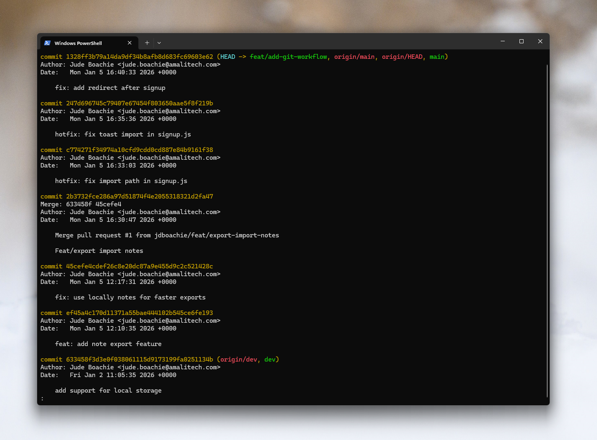
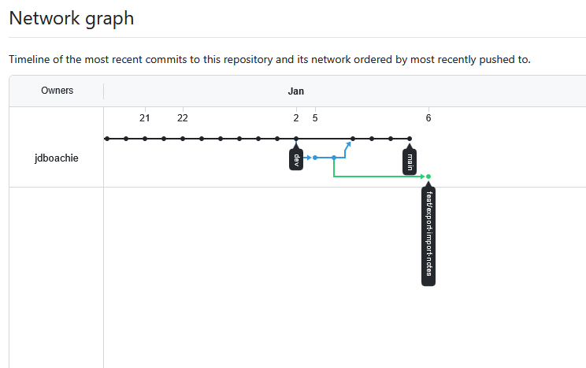
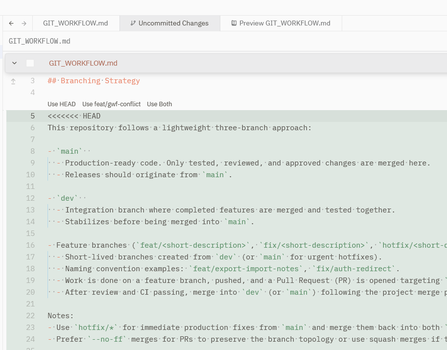
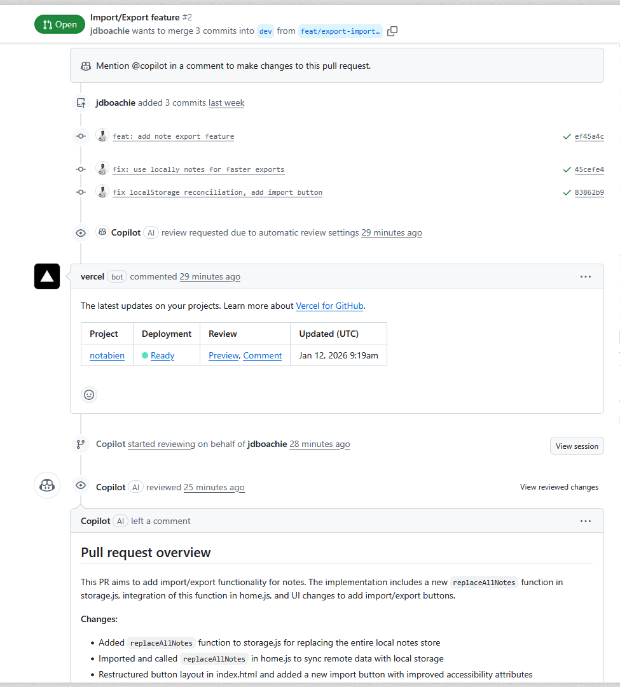

# Git Workflow Documentation

## Branching Strategy
We utilize a feature-branch workflow centered around three main branch types:

1.  **Main (`main`)**: The production-ready branch containing stable code.
2.  **Development (`dev`)**: The integration branch for testing new features before they merge to main.
3.  **Feature Branches (`feat/*`)**: Temporary branches created from `main` or `dev` to work on specific tasks (e.g., `feat/export-import-notes`, `feat/add-git-workflow`).

## Commit Conventions
We follow the **Conventional Commits** specification to ensure a readable and automated history.
Format: `<type>: <description>`

Common types used:
- `feat`: New features
- `fix`: Bug fixes
- `hotfix`: Critical fixes for production
- `docs`: Documentation changes
- `chore`: Maintenance tasks

## Merge Conflicts Encountered
**Conflict Scenario:**
Two branches, `feat/add-git-workflow` and `feat/gwf-conflict`, both attempted to create the initial `docs/GIT_WORKFLOW.md` file simultaneously with different content (Version A vs Version B).

**Resolution:**
1.  Attempted to merge `feat/gwf-conflict` into the current branch.
2.  Git flagged a conflict in `docs/GIT_WORKFLOW.md`.
3.  Opened the file and manually selected the desired content (or combined sections).
4.  Ran `git add docs/GIT_WORKFLOW.md` to stage the resolution.
5.  Committed the merge.

## Git Commands Used
- `git checkout -b <branch>`: Creating and switching to new branches.
- `git add .`: Staging files for commit.
- `git commit -m "<message>"`: Committing changes.
- `git merge <branch>`: Merging branches.
- `git push origin <branch>`: Uploading changes to remote.
- `git log --all --graph --decorate --oneline`: Visualizing history.

## Screenshots

*Git log showing commit history*

*Branch structure visualization*

*Example of a resolved merge conflict*

*Example pull request*
